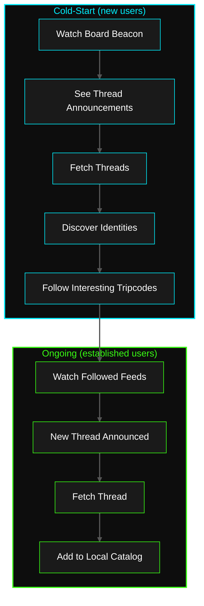
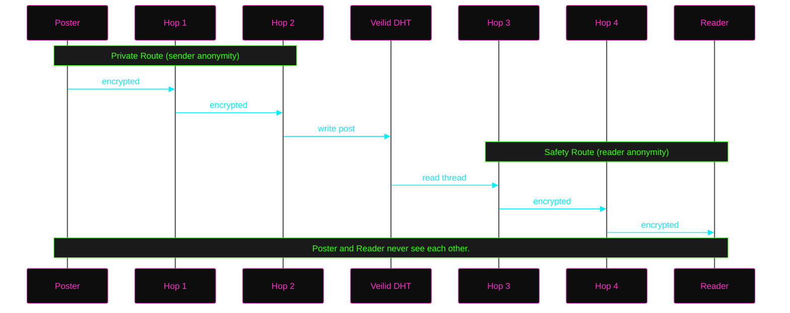
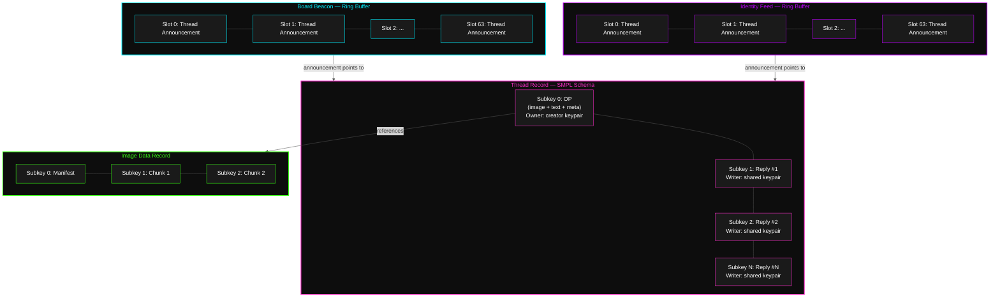
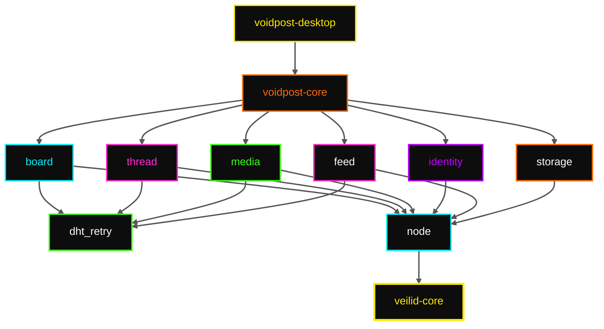

# Voidpost

**Anonymous imageboard on the Veilid network.**

A decentralized imageboard built on [Veilid](https://veilid.com), the
peer-to-peer application framework from the [Cult of the Dead Cow](https://cultdeadcow.com/).

- **No servers.** Threads are DHT records. No infrastructure to seize or subpoena.
- **No IP logs.** Veilid's onion routing means there are no direct connections to log.
- **Anonymous by default.** Optional identity via [Ed25519](https://en.wikipedia.org/wiki/EdDSA#Ed25519) tripcodes.
- **Ephemeral.** Content persists while people engage with it and expires when they stop. 
- **Grief-resistant.** Two-layer discovery combines shared beacons with single-owner identity feeds.

---

## Table of Contents

- [Boards](#boards)
- [Threads](#threads)
- [Posts & Images](#posts--images)
- [Identity](#identity)
- [Discovery](#discovery)
- [Record Lifecycle](#record-lifecycle)
- [Privacy](#privacy)
- [Abuse Resistance](#abuse-resistance)
- [Diagrams](#diagrams)
- [Tech Stack](#tech-stack)
- [Project Structure](#project-structure)
- [Retry Strategy](#retry-strategy)
- [Local Persistence](#local-persistence)
- [Testing Strategy](#testing-strategy)
- [Non-Goals](#non-goals)
- [Why Veilid?](#why-veilid)

---

## Boards

A board (e.g. `/void/`) is a DHT record at a deterministic address derived
from the board name. This record is called the **beacon**.

**Address derivation:**
[`blake3::derive_key`](https://docs.rs/blake3/latest/blake3/fn.derive_key.html)`("voidpost.board.v1", name)`
produces a 32-byte seed → deterministic
[Ed25519](https://en.wikipedia.org/wiki/EdDSA#Ed25519) keypair → the public
key is the DHT address. Anyone who knows the board name derives the same
keypair, so anyone can read and write to it.

**Structure:** 64 subkeys used as a ring buffer. Each subkey holds one
[thread announcement](#thread-announcements). New announcements overwrite the
oldest slot. Concurrent writers race; last write wins.

The beacon is the **cold-start** discovery layer. New clients use it to find
threads when they first arrive. Established clients rely on
[identity feeds](#identity-feeds) instead. See [Discovery](#discovery).

---

## Threads

Each thread is its own DHT record using the
[SMPL schema](https://docs.rs/veilid-core/latest/veilid_core/struct.DHTSchemaSMPL.html):

| Subkey | Content | Writer |
|--------|---------|--------|
| 0 | OP (image + text + metadata) | Thread creator's keypair (only they can edit it) |
| 1..N | Replies | Shared writer keypair (anyone with the secret can write) |

The shared writer secret is published in the
[thread announcement](#thread-announcements), so anyone who discovers the
thread can reply. All replies are signed with the same key, making repliers
indistinguishable at the DHT level. This is how anonymity is enforced at the
protocol layer.

**Reply coordination:** Read the thread, find the next empty subkey, write
there. If two repliers race for the same slot, last write wins and the loser
retries on the next slot.

**Limits:** Max 300 replies per thread (301 subkeys total including OP).
Each subkey holds up to 32KB
([`ValueData::MAX_LEN`](https://docs.rs/veilid-core/latest/veilid_core/struct.ValueData.html#associatedconstant.MAX_LEN)).

### Thread Announcements

A thread announcement is written to a [beacon](#boards) slot and/or an
[identity feed](#identity-feeds) slot. It contains everything a client needs
to open the thread:

| Field | Purpose |
|-------|---------|
| `thread_key` | DHT RecordKey for the thread (includes encryption key) |
| `writer_secret` | Shared writer secret — lets anyone post replies |
| `title` | Subject line |
| `timestamp` | Creation time |
| `op_tripcode` | Creator's tripcode, if any |

---

## Posts & Images

A post contains:
- **Text** — UTF-8, stored directly in the subkey
- **Image** (optional) — stored in a separate DHT record, referenced by key
- **Metadata** — timestamp, optional username + tripcode

**Image handling:** Images are chunked across DHT subkeys (32KB each).
Subkey 0 holds a chunk manifest; subkeys 1..N hold the data.

| Constraint | Value |
|------------|-------|
| Max image size | 1MB |
| Accepted formats | JPEG, PNG, WebP |
| Max chunks | 32 subkeys per image |
| Thumbnailing | None — client renders full image |

If the image record expires, the post survives as text only.

**Encryption:** Every DHT record is encrypted with a key embedded in its
RecordKey. Sharing the RecordKey shares read access. Thread keys propagate
through announcements; image keys are in post metadata. Veilid handles
encryption transparently — DHT operators, relay nodes, and network observers
all see ciphertext.

---

## Identity

**By default, every post is anonymous.** Thread OPs use a single-use keypair.
Replies use a shared keypair. Nothing links one post to another.

### Tripcodes

Users who want continuity can create a persistent identity: a username +
[Ed25519](https://en.wikipedia.org/wiki/EdDSA#Ed25519) keypair stored locally.
The public key becomes a **tripcode** — a short hex string that proves
identity through signature verification (not
[4chan-style](https://en.wikipedia.org/wiki/Imageboard#Tripcodes)
[DES](https://en.wikipedia.org/wiki/Data_Encryption_Standard) password
hashing).

Posts display as **`username #A3F2B1C0`**. The username is cosmetic (anyone
can pick any name); the tripcode is the proof. Two users can share a name,
but their tripcodes will differ.

**Management:**
- Change username at any time — tripcode stays (it's tied to the keypair)
- Export identity as portable JSON — back it up, move to another machine
- Import identity — same keypair = same tripcode = same feed
- Delete identity — keypair destroyed, tripcode dead

### Identity Feeds

When a user creates a tripcode, the client also creates a personal DHT
record — their **identity feed**. This is the second layer of the
[discovery](#discovery) system.

| Property | Value |
|----------|-------|
| Schema | SMPL, 1 member (identity keypair), 64 subkeys |
| Owner | The identity Ed25519 keypair |
| Key derivation | `blake3::derive_key("voidpost.feed.v1", identity_public_key_bytes)` |
| Layout | 64-slot ring buffer (same structure as board beacon) |
| Content | Thread announcements (same format as beacon entries) |

Key properties:
- **Deterministic address.** Anyone who knows the tripcode can derive the feed
  address — no out-of-band exchange needed.
- **Single owner.** Only the identity holder can write to their feed. Unlike
  the shared-write beacon, feeds cannot be griefed.

---

## Discovery

Thread discovery has two layers, each solving a different problem.

### Layer 1: Board Beacon

The beacon is a shared-write record derived from the board name. It handles
**cold-start** — when a user arrives at a board for the first time with no
existing social connections.

- First install ships with default boards (`/void/`, `/tech/`, `/art/`)
- Users add boards by name, link (`voidpost:///board/name`), or QR code
- Client watches the beacon and pulls thread announcements as they appear

The beacon is permissionless and therefore griefable. This is an accepted
trade-off for cold-start accessibility.

### Layer 2: Identity Feeds

Once a user follows identities (via tripcode), their client watches those
identity feeds directly. New threads from followed users appear without
touching the beacon.

As users accumulate follows, their dependence on the beacon decreases. The
beacon shifts from primary discovery mechanism to fallback.

### How They Work Together

**Thread creation** (user with identity):

1. Create SMPL thread record, write OP to subkey 0
2. Write announcement to board beacon (for cold-start users)
3. Write announcement to own identity feed (for followers)

**Cold-start** (new user, no follows):

1. Derive beacon → watch it → see announcements
2. Fetch each thread → validate OP exists (filters garbage)
3. Find interesting tripcodes → follow them
4. Client watches their feeds → discovery shifts to feed-based

**Beacon under attack** (all 64 slots overwritten with garbage):

| User type | Impact |
|-----------|--------|
| Established (has follows) | None — catalog built from feeds |
| New (no follows, has an identity link) | Bypasses beacon via `voidpost:///identity/...` |
| New (no follows, no link) | Degraded — must wait for beacon spam to lapse |

**Resilience comparison:**

| Scenario | Beacon only | Beacon + feeds |
|----------|------------|----------------|
| Normal | Works | Both work |
| Beacon griefed | Board dead | Only cold-start degraded |
| Cold-start + griefed | No recovery | One identity link → full recovery |
| Targeted suppression | Trivial | Requires every followed identity's private key |

### Emergent Properties

- **Curation over censorship.** Users who post quality threads get followed.
  They become curators — surfacing content, not removing it.
- **Cross-board discovery.** Following someone in `/void/` also surfaces their
  `/tech/` threads. Discovery crosses board boundaries.
- **Portable reputation.** Feeds follow the keypair, not any board.
- **Resilience scales with community.** More follows = less beacon dependence.

---

## Record Lifecycle

DHT records expire if nobody refreshes them. Voidpost uses this as a feature:
dead threads die naturally. Live threads survive through a hybrid of explicit
and passive refresh.

### Creator Keep-Alive

The thread creator's client periodically re-publishes the OP subkey while the
app is open. Close the app, and the creator's heartbeat stops.

### Passive Refresh (Readers)

Every `get_dht_value` with `force_refresh: true` causes Veilid to re-fetch
and republish the value. **Reading a thread refreshes it.** Ten readers = ten
independent refresh sources.

### Feed Refresh

Identity feeds follow the same model. The holder's client re-publishes
periodically; followers refresh passively by watching.

### Lifecycle Summary

| Record | Kept alive by | Dies when |
|--------|--------------|-----------|
| Board beacon | Clients browsing the board | No readers for TTL period |
| Thread OP | Creator keep-alive + readers | Creator offline + no readers |
| Thread replies | Readers who fetched them | All readers leave |
| Image data | Readers who viewed the image | No re-fetch for TTL period |
| Identity feed | Holder + followers | Holder offline + no followers |

---

## Privacy

**Principle: the system cannot betray its users, even under compulsion.**

- **[Private Routes](https://veilid.com/how-it-works/)** — DHT writes are
  routed through multiple hops. The poster's IP and node ID are not visible
  to the DHT.
- **[Safety Routes](https://veilid.com/how-it-works/)** — DHT reads are
  routed the same way. The reader's identity is hidden from the nodes
  serving data.
- **No mandatory identity.** There is nothing to link or subpoena.
- **Zero telemetry.** No analytics. Only encrypted Veilid protocol traffic
  leaves your machine.
- **Encrypted records.** Every DHT record is encrypted with a key in its
  RecordKey. Operators see ciphertext.
- **No global state.** No single entity knows all threads on a board. Each
  client's view is local and approximate.

---

## Abuse Resistance

There is no server-side moderation. Censorship resistance and moderation
resistance are the same property — this is a deliberate trade-off.

### Attack Surface

| Attack | Mechanism |
|--------|-----------|
| Beacon flooding | Overwrite announcement slots with garbage |
| Reply spam | Write junk via the shared writer keypair |
| Replier impersonation | Shared keypair makes all replies look the same |

### Mitigations

| Defense | How it helps |
|---------|-------------|
| Two-layer discovery | Beacon flooding only affects cold-start. Feed-based users are unaffected. |
| Announcement validation | Clients fetch the actual thread for each announcement. Garbage pointing to nonexistent records is discarded. |
| Veilid rate limiting | The DHT rate-limits writes per node. Sustained flooding costs real resources. |
| OP integrity | Only the creator's keypair can modify subkey 0. The OP is immutable to everyone else. |
| Client-side filtering | Local blocklists, malformed-announcement rejection, tripcode muting. |
| Ephemeral spam | Spam expires when the spammer stops refreshing. Persistence costs effort. |
| Tripcode reputation | Known tripcodes build local trust. Unknown posters can be muted. |
| Identity-link recovery | If a beacon is destroyed, a single shared identity link (`voidpost:///identity/...`) bootstraps new users through feeds. |
| Future: PoW | Proof-of-work puzzles per post. Shared filter lists between trusted tripcodes. |

---

## Diagrams

### Posting a Thread


### Posting a Reply


### Two-Layer Discovery



### Record Lifecycle


### Privacy Routes



### Record Structure



### Module Dependencies



---

## Tech Stack

| Layer | Choice |
|-------|--------|
| P2P Network | [Veilid](https://veilid.com) v0.5.2 — DHT, private routes, safety routes |
| Language | [Rust](https://www.rust-lang.org/) ([2024 edition](https://doc.rust-lang.org/edition-guide/rust-2024/)) — MSRV 1.88.0 |
| Async Runtime | [Tokio](https://tokio.rs) |
| Key Derivation | [BLAKE3](https://github.com/BLAKE3-team/BLAKE3) `derive_key` with domain separation |
| Desktop | [Tauri](https://v2.tauri.app) v2 — Windows, Linux, macOS (mobile later) |
| Serialization | [serde](https://serde.rs) + [serde_json](https://docs.rs/serde_json) |

### Why Tauri, Not a Web App?

Veilid's [WASM support](https://gitlab.com/veilid/veilid/-/blob/main/veilid-wasm/README.md)
has browser constraints that make a pure web app impractical today:

- HTTPS pages require WSS peers, but **WSS was deprecated in v0.5.0**
  ([#487](https://gitlab.com/veilid/veilid/-/issues/487)).
- HTTP pages can use WS, but lose `crypto.subtle`, Service Workers, and other
  secure-context APIs.
- The planned **Outbound Relays** feature that would bridge this gap is
  [not yet implemented](https://gitlab.com/veilid/veilid/-/blob/main/veilid-wasm/README.md).
- Browser tabs throttle/kill background tasks, breaking the keep-alive
  refresh model.
- WASM has no UDP/TCP sockets — limited to WebSocket relay hops.

Tauri v2 gives a web frontend with a native Rust backend calling
`veilid-core` directly. Full network stack, no sandbox limitations.

### Veilid v0.5.x API Notes

[Veilid v0.5.0](https://gitlab.com/veilid/veilid/-/blob/main/CHANGELOG.md)
breaking changes from v0.4.x:

- `api_startup_config` → `api_startup`
- `TypedPublicKey` → `PublicKey`, `TypedSecretKey` → `SecretKey`,
  `TypedKeyPair` → `KeyPair`
- Encryption on by default for all DHT operations
- `watch_dht_values()` returns `bool` (not `Timestamp`)
- `footgun` feature flag gates unsafe routing contexts

### Veilid Primitives Used

| Feature | Primitive | Purpose |
|---------|-----------|---------|
| Anonymous posting | [Private routing](https://veilid.com/how-it-works/) + shared writer keypair | No per-post identity |
| Thread expiry | DHT record TTL | Stop refreshing → record dies |
| Image hosting | Chunked subkeys | Values cap at 32KB ([`ValueData::MAX_LEN`](https://docs.rs/veilid-core/latest/veilid_core/struct.ValueData.html#associatedconstant.MAX_LEN)) |
| Board discovery | Deterministic keypair from [BLAKE3](https://github.com/BLAKE3-team/BLAKE3) | Same name → same address |
| Identity feeds | Single-owner [SMPL](https://docs.rs/veilid-core/latest/veilid_core/struct.DHTSchemaSMPL.html) record | Ungriefable per-identity channel |
| Thread watching | [`watch_dht_values`](https://docs.rs/veilid-core/latest/veilid_core/struct.RoutingContext.html) | `ValueChange` callback on new replies |
| Tripcodes | [Ed25519](https://en.wikipedia.org/wiki/EdDSA#Ed25519) keypair | Signature verification |
| Multi-writer threads | [SMPL schema](https://docs.rs/veilid-core/latest/veilid_core/struct.DHTSchemaSMPL.html) | Shared keypair for open replies |

---

## Project Structure

```
voidpost/
├── packages/
│   ├── core/            # Rust library
│   │   ├── node.rs      # Veilid lifecycle & routing context
│   │   ├── board.rs     # Beacon records, thread discovery
│   │   ├── thread.rs    # SMPL-schema thread records, OP + replies
│   │   ├── media.rs     # Image chunking into DHT
│   │   ├── identity.rs  # Tripcodes, keypair management
│   │   ├── feed.rs      # Identity feed creation, announcement, watching
│   │   ├── dht_retry.rs # Exponential backoff + jitter
│   │   ├── storage.rs   # Local persistence via Veilid TableDB
│   │   └── types.rs     # Post, ThreadMeta, ThreadAnnouncement
│   └── desktop/         # Tauri v2 desktop app
│       ├── src/         # Rust backend (Tauri commands)
│       └── ui/          # Web frontend
├── Cargo.toml           # Workspace root
├── LICENSE              # GPL-3.0
└── README.md
```

---

## Retry Strategy

DHT operations are unreliable by nature. The `dht_retry` module wraps every
call with:

- **Exponential backoff + jitter** — 100ms base, doubling to 5s max, random
  jitter to prevent thundering herds
- **Max 5 retries** — then fail to caller
- **Idempotent writes** — `set_dht_value` uses sequence numbers; stale
  retries are safely rejected
- **Force-refresh reads** — failed reads retry with `force_refresh: true`

---

## Local Persistence

Uses Veilid's
[`TableDB`](https://docs.rs/veilid-core/latest/veilid_core/struct.TableDB.html)
(general data) and
[`ProtectedStore`](https://docs.rs/veilid-core/latest/veilid_core/struct.ProtectedStore.html)
(sensitive data):

| Data | Storage | Notes |
|------|---------|-------|
| Identity keypair + username | `ProtectedStore` | Encrypted at rest |
| Followed identities | `TableDB` | Tripcode → feed key mapping |
| Watched board list | `TableDB` | Survives restarts |
| Cached thread metadata | `TableDB` | Fast catalog rendering |
| Client-side blocklists | `TableDB` | Muted tripcodes + hidden threads |
| Settings | `TableDB` | User preferences |

All data lives inside Veilid's managed storage. Uninstall removes everything.

---

## Testing Strategy

Four layers:

1. **Unit tests** — Ring buffer indexing, serialization, BLAKE3 derivation,
   retry timing. No network.
2. **Integration tests** — 2-3 Veilid nodes in local-network mode. Real DHT
   operations: create, write, watch, expire.
3. **Mock [`RoutingContext`](https://docs.rs/veilid-core/latest/veilid_core/struct.RoutingContext.html)**
   — Trait-based abstraction; inject canned responses or simulated errors.
4. **Chaos injection** — Simulate `TryAgain`, timeouts, partitions to stress
   the retry strategy.

---

## Non-Goals

- **Server-side moderation** — There is no server. Moderation is client-side
  (blocklists, tripcode muting) or social (shared filter lists).
- **Permanent archival** — Threads expire by design.
- **Large files** — 1MB image cap. No video, audio, or PDFs.
- **Private messaging** — Veilid has
  [`AppMessage`](https://docs.rs/veilid-core/latest/veilid_core/enum.VeilidUpdate.html),
  but Voidpost is a public forum. DMs are a future possibility.
- **Federation** — No clearnet bridges, Matrix links, or RSS feeds.

---

## Why Veilid?

Veilid provides encrypted P2P routing and distributed storage with no
blockchain and no token. It's infrastructure, not a financial instrument.

Alternatives and their problems:

| Project | Issue |
|---------|-------|
| [LBRY](https://en.wikipedia.org/wiki/LBRY) | Token attracted [SEC enforcement](https://www.sec.gov/litigation/litreleases/2021/lr25060.htm) — [sought $22M, settled ~$112K](https://www.theguardian.com/technology/2023/jul/16/lbry-closes-odysee-cryptocurrency-tech-sec-fraud-extremist), legal costs killed the company |
| [Tor](https://www.torproject.org) | Anonymizes streams, doesn't store content |
| [IPFS](https://ipfs.tech) | Distributed storage, no native anonymity (nodes advertise what they host) |
| [GNUnet](https://gnunet.org) | Promising since [2001](https://en.wikipedia.org/wiki/GNUnet), minimal adoption |

Veilid combines anonymous routing, distributed storage, and zero regulatory
attack surface from token economics.

---

*Shout into the void. Someone might shout back.*
