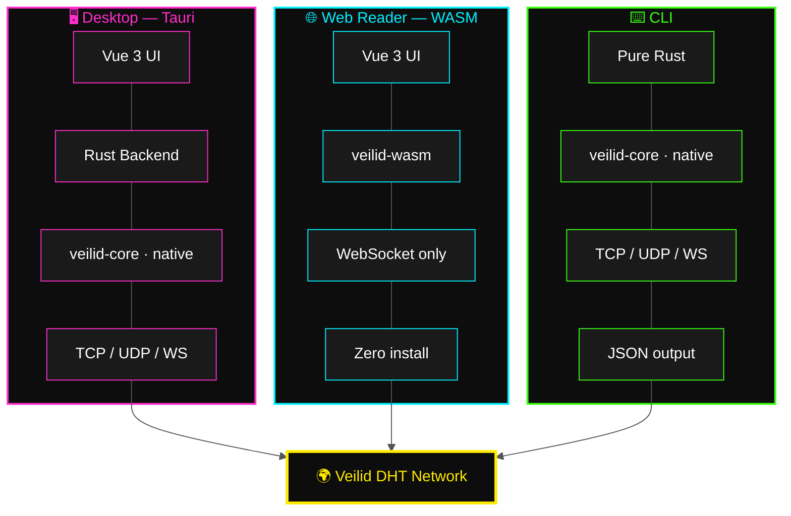
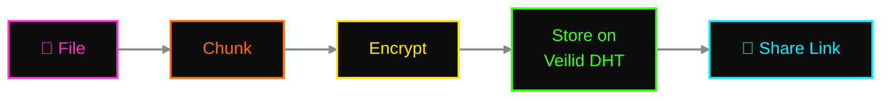
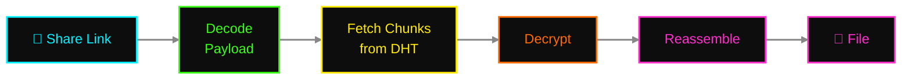
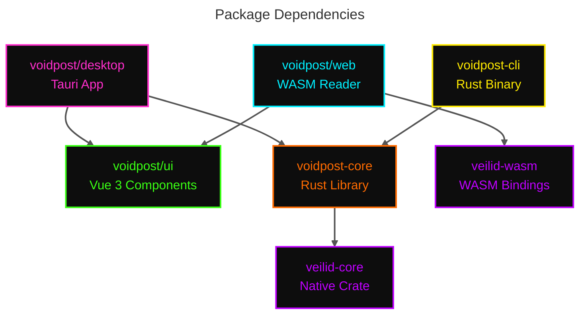
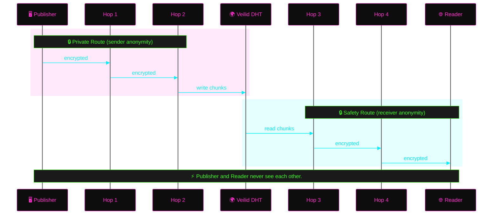

# 🕳️ Voidpost

**Anonymous document sharing on the Veilid network.**

Voidpost is a decentralized, zero-identity document sharing system built on
[Veilid](https://veilid.com) — the peer-to-peer framework from the
[Cult of the Dead Cow](https://cultdeadcow.com/),
the same beautiful maniacs who've been rattling the surveillance industry's
cage since 1984. No accounts. No servers. No tokens. No metadata breadcrumbs
for some three-letter agency to vacuum up at 3 AM. You publish a document,
you get a link, and anyone holding that link can pull it out of the ether.
The network handles the rest. You were never here.

---

## ⚡ What It Does

You drop a file into Voidpost. The system tears it apart — encrypted, chunked,
and hurled across the Veilid DHT, a distributed hash table smeared over
thousands of nodes on every continent that has electricity and an opinion.
What comes back is a share link. That link is everything: the coordinates, the
decryption key, the whole payload manifest. The publisher is hidden behind
Veilid's private routing. The reader is hidden behind safety routing. The
document itself exists simultaneously on dozens of machines owned by people
who will never know they're carrying it. Everywhere and nowhere. The way
information was always supposed to work before the landlords showed up.

---

## 🏗️ Architecture

The architecture is built on an asymmetry that most projects get catastrophically
wrong: **publishing is a commitment** — you're staking network resources to keep
data alive — while **reading is a hit-and-run** — grab the goods and vanish.
Voidpost doesn't pretend these are the same operation. It gives each one the
tool it deserves.

### 🔌 Three Clients, One Network



| Client | Publish | Read | Refresh | Install |
|--------|---------|------|---------|---------|
| **Desktop** (Tauri) | ✅ | ✅ | ✅ System tray | Yes |
| **Web Reader** (WASM) | ❌ | ✅ | ❌ | No — just click a link |
| **CLI** | ✅ | ✅ | ✅ Daemon mode | Yes |

### 📤 Data Flow — Publish



### 📥 Data Flow — Retrieve



The share link is a URL fragment (`#/read/<payload>`) — everything after the
`#` stays in the browser. It never touches a server. It never appears in access
logs. It never becomes evidence. The fragment is constitutionally incapable of
being logged by infrastructure you don't control.

---

## 🧰 Tech Stack

Every dependency here earned its seat. No hype-driven decisions or framework-of-the-week gambling with production stability. 🎰🚫

| Layer | Choice |
|-------|--------|
| 🌐 P2P Network | [Veilid](https://veilid.com) (v0.5.2) — DHT, private routes, safety routes |
| 🖥️ Desktop Framework | [Tauri v2](https://v2.tauri.app) — Rust backend, system webview, ~5MB binary |
| 🎨 UI Framework | Vue 3 + Composition API + TypeScript (strict) |
| 🧠 State Management | Pinia |
| 💅 Styling | Tailwind CSS |
| ⚡ Build Tool | Vite |
| 🕸️ WASM Bindings | veilid-wasm (official) |
| ⌨️ CLI Framework | clap (Rust) |
| 📦 Monorepo | pnpm workspaces (TS) + Cargo workspace (Rust) |

---

## 🗂️ Monorepo Structure

One repo. Clean lines. Every package knows its job and stays in its lane —
the kind of separation of concerns that would make a grown architect weep
quietly into their coffee.

```
voidpost/
├── packages/
│   ├── ui/              # Shared Vue 3 component library
│   ├── desktop/         # Tauri desktop app (publisher + reader)
│   ├── web/             # WASM web reader (zero-install, read-only)
│   ├── cli/             # Rust CLI (power users + automation)
│   └── core/            # Shared Rust library (veilid, crypto, chunking)
├── package.json         # pnpm workspace root
├── pnpm-workspace.yaml
├── Cargo.toml           # Rust workspace root
└── README.md
```

### 🔗 Package Dependencies



---

## 🖥️ Platform Support

If it has a screen and a network stack, we'll get to it eventually. 🌍
CLI is the beachhead. The rest follows.

### 🖥️ Desktop (Tauri v2)
- 🐧 Linux (.deb, .AppImage, .rpm)
- 🍎 macOS (.dmg — signed + notarized)
- 🪟 Windows (.msi, .exe — signed )
- 🤖 Android (.apk — future)
- 📱 iOS (future)

### 🌐 Web Reader
- 🏄 Any modern browser with WASM support

### ⌨️ CLI
- 🛠️ Linux, macOS, Windows (prebuilt binaries + `cargo install`)

---

## 🛡️ Privacy Model

🔐 Privacy is not a feature in Voidpost. It is the architecture. Strip it out
and there is nothing left — no app, no protocol, no reason to exist. Every
design decision flows downstream from one principle: **the system must not
be capable of betraying its users, even under duress.**



- 👻 **No accounts, no identity, no tokens.** There is nothing to link, nothing
  to subpoena, nothing to hand over in a conference room with bad lighting
  and worse intentions.
- 🕳️ **Private Routes** — The publisher's node identity is severed from DHT writes.
  Your operations bounce through multiple relay hops before they touch the
  hash table. Your IP never shares a zip code with your data.
- 🛤️ **Safety Routes** — The reader gets the same treatment in reverse.
  Pull a document off the DHT and your node ID is nowhere near the request.
- 🔗 **URL fragments** — The share link's payload lives after the `#`. Browsers
  do not send fragments to servers. Period. Not in headers, not in referrers,
  not in any log that any sysadmin on earth will ever read.
- 🚫 **Zero telemetry** — No analytics. No phone-home. No clever "anonymous
  usage metrics" that always turn out to be neither anonymous nor metric.
  The only packets leaving your machine are Veilid protocol.
- 🔒 **Encrypted at rest** — Documents are ciphertext before they ever touch the
  DHT. Node operators, relay operators, network observers — they all see the
  same thing: noise. Beautiful, uninterpretable, plausibly-deniable noise. 📡

---

## 🐄 Why Veilid?

Because every other option has a fatal flaw and we're tired of pretending
otherwise. 🪦

Veilid is a pure infrastructure protocol — no blockchain, no token, no
financialized incentive structure that turns every participant into a day
trader with a node. It offers encrypted P2P routing and distributed storage
as a public utility, the way the internet was supposed to work before
venture capital got its hooks into the protocol layer.

LBRY tried the token play and the SEC gutted them in open court — a $22M
fine and a full shutdown, because when you issue a token, you've handed
regulators the exact weapon they need to destroy you. Tor works, but it was
built for anonymizing streams, not distributing content. IPFS has distributed
storage but zero native anonymity — your node announces what you're hosting
to anyone who asks. GNUnet has been academically promising since 2001 and
will be academically promising when the sun burns out.

Veilid is the convergence point: anonymous routing + distributed storage +
no legal attack surface from token economics. Built by people who understand
that the most important feature of a privacy tool is not getting shut down.

---

*"🕳️ Voidpost. 🔐 Encrypted at birth. 👻 Anonymous by design. 💨 Gone when you're done."*
