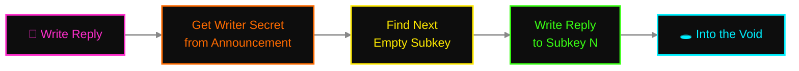
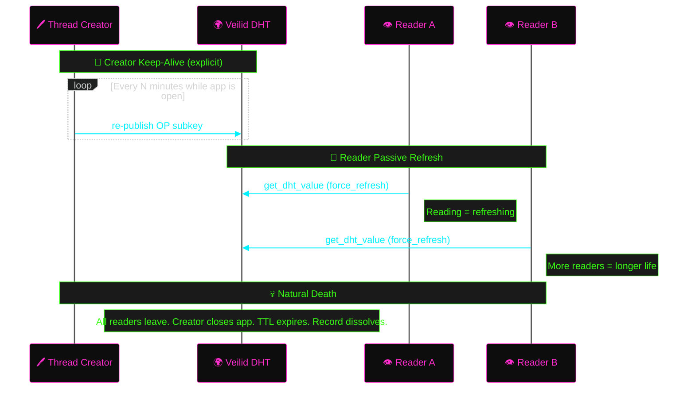
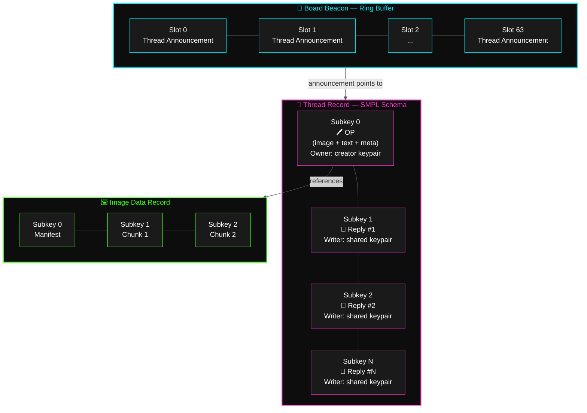
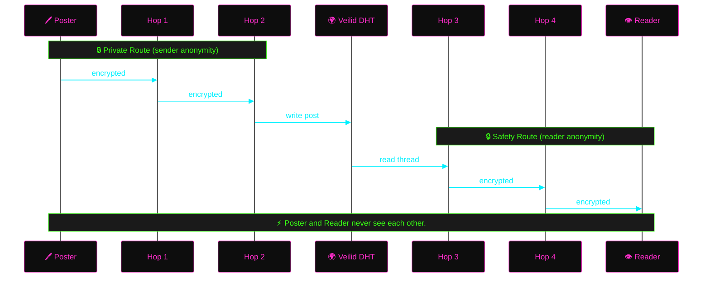
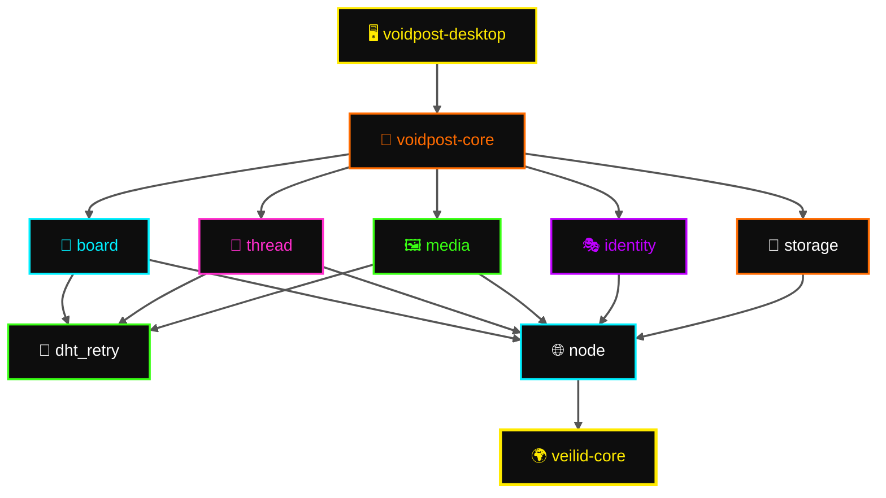

# 🕳️ Voidpost

**Anonymous imageboard on the Veilid network.**

Voidpost is a decentralized, anonymous imageboard built on
[Veilid](https://veilid.com) — the peer-to-peer application framework from
the [Cult of the Dead Cow](https://cultdeadcow.com/), the folks building 
strange and necessary things since 1984.
Forty-two years of making the surveillance industry sweat
through its dress shirts.

No servers. No moderation hierarchy. No metadata breadcrumbs for some
three-letter agency to vacuum up on a Tuesday afternoon while they wait for
their FISA warrants to print. Threads live on the Veilid DHT instead of a
database. They persist as long as people engage with them and dissolve back
into nothing when they don't. Every post is anonymous by default. Every
node assembles its own view of the board from what it hears on the network.
There is no canonical state. There is no authority. You shout into the void,
and whoever's listening hears you. Nobody else.

Think 4chan, but:
- 🚫 No server to seize, subpoena, or shut down
- 👻 No IP logs because there are no connections to log
- 🗝️ Anonymous by default — set a username if you want, or don't
- 💨 No permanent archive — impermanence is load-bearing

---

## 📡 How It Works

### 🏴 Boards

A board (e.g. `/void/`) is a well-known DHT record derived deterministically
from the board name. It acts as a **beacon** — not a catalog, not a source of
truth, just a signal flare screaming "something happened here recently" into
the network's indifferent expanse.

The beacon address is derived via
[`blake3::derive_key`](https://docs.rs/blake3/latest/blake3/fn.derive_key.html)`("voidpost.board.v1", name)`, which produces a
32-byte seed used to derive a deterministic [Ed25519](https://en.wikipedia.org/wiki/EdDSA#Ed25519) keypair. The public
key becomes the DHT record address.
**Anyone who knows the board name derives the same keypair** — meaning anyone
can read *and write* to the beacon. No gatekeepers. No access control list
maintained by some volunteer moderator on their fourth energy drink. You
know the name, you're in.

The beacon is a record with 64 subkeys used as a ring buffer. Each subkey
holds a thread announcement. New announcements overwrite the oldest: the
poster reads all 64 slots, finds the one with the oldest timestamp (or an
empty slot), and writes there. Concurrent posters may race for the same
slot — last write wins. The ring never blocks. Old threads get evicted by
new ones. Sixty-four slots, no negotiation, the capacity of the room is
the capacity of the room.

The beacon is a hint. Clients that already know about threads don't need it.
Clients that just arrived use it to get their bearings. Nobody trusts it
as gospel. Treat it like graffiti on a bathroom wall — some of it's real,
some of it's noise, and the only way to find out is to follow the pointer.

### 📝 Threads

Each thread is an independent DHT record using the [SMPL schema](https://docs.rs/veilid-core/latest/veilid_core/struct.DHTSchemaSMPL.html):
- **Subkey 0:** OP — image + text + metadata, owned by the thread creator's
  keypair. Only the creator can modify the OP. This is the one authenticated
  post in the thread.
- **Subkeys 1..N:** Replies, writable via a shared writer keypair whose secret
  is published in the thread announcement — anyone who finds the thread can
  reply.

**Reply coordination:** repliers read the thread's current state, find the
next empty subkey, and write there. Concurrent repliers may race for the same
slot — last write wins and the loser scans for the next opening. On a
fast-moving thread this means occasional retries. On a typical thread,
contention is a rounding error. There is no lock server because there is
no server. The absence of coordination infrastructure is not a gap in the
design. It is the design.

Threads have a max reply count (default 300). When they're full, they're
full. Start a new thread or find something else to do. This is the same
natural death cycle as every imageboard that ever existed, except the
gravedigger is thermodynamics instead of a MySQL cronjob running on a
VPS that someone forgot to pay for.

**Capacity budget:** Each subkey holds up to 32KB ([`ValueData::MAX_LEN`](https://docs.rs/veilid-core/latest/veilid_core/struct.ValueData.html#associatedconstant.MAX_LEN)).
A thread with 300 reply subkeys + 1 OP subkey = 301 subkeys total. The
SMPL schema supports this. Text-only replies fit comfortably in a single
subkey. Images are chunked into a separate DHT data record (see below), so
they don't eat into the reply subkey budget.

### 📋 Thread Announcements

A thread announcement is the data written to a beacon slot. It contains
everything a client needs to render a catalog entry and open the thread:

| Field | Purpose |
|-------|---------|
| `thread_key` | Veilid RecordKey for the thread record (includes built-in encryption key) |
| `writer_secret` | Secret key of the shared writer keypair — enables anyone to post replies |
| `title` | Thread subject line (plain text) |
| `timestamp` | When the thread was created |
| `op_tripcode` | Creator's tripcode, if any (for catalog display) |

The `writer_secret` being public is intentional. Publish the secret,
and anyone who reads the beacon can write to the thread. The OP is the only
cryptographically authenticated post — every reply is signed with the same
shared key, making repliers indistinguishable at the DHT level. Someone will
look at this and call it a security flaw. It is not. It is the mechanism by
which anonymity is enforced at the protocol layer. You cannot de-anonymize
a reply because there is nothing to de-anonymize — the key that wrote it
belongs to everyone. Application-level identity (tripcodes) exists for users
who want to be recognized. Everyone else is cryptographic static.

### 🔍 Discovery — The Gossip Model

There is no catalog server. There is no "fetch the board" endpoint. Nobody
maintains an index. Discovery is gossip, and gossip has always been the
most resilient information protocol humans ever invented. It's also
unreliable, which is the price of resilience, and we pay it gladly.

1. Board name → [`blake3::derive_key`](https://docs.rs/blake3/latest/blake3/fn.derive_key.html)`("voidpost.board.v1", name)` → deterministic
   [Ed25519](https://en.wikipedia.org/wiki/EdDSA#Ed25519) keypair → DHT record at a predictable address (the beacon). Anyone
   who knows the name derives the same keypair and finds the same record.
2. Clients `watch_dht_values` on the beacon. When a new thread announcement
   appears in any subkey, they fetch the thread record and add it to their
   local catalog.
3. Clients also watch threads they're reading. New reply → bump it in the
   local view.
4. Thread goes quiet → nobody refreshes it → DHT expires it → client notices
   it's gone → removes it from local catalog. Ashes to ashes, packets to
   entropy.
5. Brand-new client joining `/void/` sees only the beacon's last 64
   announcements and builds from there. Everything before that is gone.
   You don't get to complain about it. You knew the deal when you walked in.

**Bootstrap:** A brand-new install ships with a default board list
(e.g. `/void/`, `/tech/`, `/art/`) so first launch isn't a blank screen
and an existential crisis. Users can add boards by name, by shared link
(`voidpost:///board/name`), or by QR code. The onboarding UX is: pick a
board → watch the beacon → threads appear. No account creation, no signup
flow, no captcha, no email verification sent to an inbox that's already
90% breach notifications.

### ✍️ Posts

A post is the atomic unit. Every post is:
- **Text** — UTF-8, stored directly in the subkey value
- **Image** (optional) — chunked into a separate DHT data record,
  referenced by record key
- **Metadata** — timestamp, optional username + tripcode

**Image constraints:**
- Max image size: **1MB** (chunked across subkeys at 32KB each = up to 32
  subkeys per image, with subkey 0 reserved for the chunk manifest)
- Accepted formats: **JPEG, PNG, WebP** — validated client-side before upload
- No thumbnailing or preview generation — clients render the full image or
  nothing

No CDN. No S3 bucket with a misconfigured ACL waiting to become next week's
data breach headline. The image is ciphertext scattered across the planet.
Your client reassembles it. If the image record has expired, the post
survives without it — text is text, and text endures.

### 🔐 Encryption

Every DHT record is encrypted with a random key baked into its RecordKey at
creation time. Share the RecordKey and you share read access. Thread keys
are published in beacon announcements. Image keys are embedded in post
metadata. Veilid handles the encryption transparently — there is no
application-layer crypto bolted on top because the transport layer already
does it right, and doubling up would be security theater for people who
confuse complexity with safety.

DHT node operators, relay operators, backbone routers, national intelligence
agencies with lawful intercept equipment — they all see the same thing:
ciphertext. Indistinguishable from random noise. The only way to read a
record is to possess its RecordKey. Thread keys propagate through beacon
announcements. The beacon itself is derived from the board name — knowing
the name is the root of access. An observer who doesn't know which board
to look for sees nothing. An observer who does know the board name can
read what everyone else reads. That's the threat model and it's honest.

### 🎭 Identity

Anonymous by default. The DHT write mechanism carries no identity — thread
OPs use a keypair generated specifically for that thread, and replies flow
through a shared writer keypair published in the thread announcement. There
is nothing in the write itself that links post A to post B. Without a
username, you are indistinguishable from background radiation.

But some people want continuity. They want to be the person who always
shows up in `/tech/` with the sharp takes. Fine. Set a **username** on first
launch (or whenever you feel like it in settings). This generates a
persistent [Ed25519](https://en.wikipedia.org/wiki/EdDSA#Ed25519) keypair stored locally on your machine. The public key
becomes your **tripcode** — a short hex string that proves identity the way
cryptography has always proven identity: by demonstrating possession of a
private key. This is not [4chan's tripcode system](https://en.wikipedia.org/wiki/Imageboard#Tripcodes), which is a [DES](https://en.wikipedia.org/wiki/Data_Encryption_Standard) hash of a
password that someone will crack in six minutes with a laptop and hashcat.
This is [Ed25519](https://en.wikipedia.org/wiki/EdDSA#Ed25519). The math is doing actual work.

Your posts display as: **`username #A3F2B1C0`** — the username you chose
plus the tripcode derived from your public key. Both are stored in the post
data on the DHT. The username is cosmetic — anyone can pick any name. The
tripcode is the proof. Two people can call themselves "anon" but their
tripcodes will be different. The tripcode is what you trust, not the name.

From settings you can:
- 🔄 **Change your username** at any time — tripcode stays the same (it's
  tied to the keypair, not the name). Your old posts still show the old name
  because they're already written to the DHT. New posts show the new name.
- 📤 **Export your identity** — keypair + username as a portable JSON file.
  Move it to another machine, back it up, engrave it on a steel plate and
  bury it in the yard. Your call.
- 📥 **Import an identity** — restore from a previous export. Same keypair
  = same tripcode. Your reputation follows you.
- 🗑️ **Delete your identity** — go back to full ghost mode. The keypair is
  gone, the tripcode is dead, and nobody will ever post as you again.

Skip the username entirely and you stay fully anonymous. No identity is
attached to your posts — no username, no tripcode, no continuity between
any two things you've ever said. You are unlinkable. The system doesn't
know who you are, and more importantly, it cannot be compelled to find out.

---

## 🏗️ Architecture

Most decentralized projects arrive at the same catastrophic misunderstanding:
they try to recreate global state without a central server, and then act
surprised when the result is slow, fragile, and politically radioactive.
Voidpost starts from the opposite premise: **there is no global state, and
that's not a limitation — it's the structural guarantee that makes
everything else possible.** Every client sees a different board. Every
client's reality is local. Consensus is for blockchains and the people
who love them. We have entropy, and entropy has never let us down.

If you haven't read **How It Works** above, go do that. These diagrams
assume fluency.

### 🌊 Data Flow — Posting a Thread


### 💬 Data Flow — Posting a Reply



### 📡 Data Flow — Discovering Threads


### 🔄 Record Lifecycle — Hybrid Refresh



### 🗄️ Thread Record Structure



---

## 🔄 Refresh & Persistence

Veilid DHT records are ephemeral. If nobody refreshes them, they expire and
the network reclaims the space like a landlord changing the locks. For an
imageboard, this is not a bug you're learning to live with — it's the
central feature. Dead threads should die. But live threads need a heartbeat,
and the heartbeat has to come from somewhere.

Voidpost uses a **hybrid refresh model**: creators keep their threads alive
by explicit republishing, and readers keep everything they touch alive
passively just by looking at it. Attention is oxygen. Withdraw it and
the record suffocates.

### 📌 Creator Keep-Alive (Explicit)

When you create a thread, your client becomes its life support machine.
A background task periodically re-publishes the OP subkey to the DHT —
a heartbeat, a proof-of-caring. This runs automatically while the app is
open. Close the app and the heartbeat flatlines. If nobody else is reading
the thread, it dies on the table. If readers are keeping it alive through
passive refresh, it survives your absence.

The creator is not a server. The creator is the first interested party.
Nothing more. There is no special privilege here, just the accident of
having started the conversation.

### 👀 Reader Passive Refresh

Every `get_dht_value` with `force_refresh: true` causes Veilid to re-fetch
from the network and republish the value to nearby nodes. **Reading is
refreshing.** The act of lurking is the act of preservation. A thread
with ten readers is a thread with ten life-support machines running in
parallel. A thread with zero readers is a countdown to oblivion.

This creates a genuinely meritocratic content lifecycle, which is a phrase
that should make you suspicious because it's usually a lie, but here the
mechanism is too simple to corrupt: popular threads survive because people
keep looking at them. Unpopular threads die because nobody does. No
algorithm. No engagement score. No "trending" sidebar curated by someone
whose bonus depends on time-on-site metrics. Just attention, measured in
DHT refreshes, denominated in nothing.

### 💀 Natural Death

The last reader leaves. The creator closes their laptop. The TTL expires
and no node on the network has any reason to remember.

The record dissolves. The subkeys return to noise. The DHT nodes that
hosted it reclaim the storage for whatever comes next. There is no archive.
There is no Wayback Machine crawl. There is no "deleted but actually we
kept a copy in cold storage for compliance reasons." Gone is a word that
means something here.

| Record | Kept alive by | Dies when |
|--------|--------------|-----------|
| 📡 Board beacon | Any client browsing the board | Zero readers for TTL period |
| 📝 Thread (OP) | Creator's keep-alive + readers | Creator offline + no readers |
| 💬 Thread replies | Readers who fetched them | All readers leave |
| 🖼️ Image data | Readers who viewed the image | Nobody re-fetches for TTL period |

---

## 🛡️ Privacy Model

Privacy is not a feature in Voidpost. It is the load-bearing wall. Remove
it and the building collapses into a pile of components that have no reason
to exist. Every design decision flows downstream from one principle:
**the system must not be capable of betraying its users, even under duress,**
**even under subpoena, even under the kind of pressure that makes engineers**
**at other companies suddenly discover that their "anonymous" telemetry was**
**actually quite identifiable all along.**



- 👻 **No mandatory identity, no tokens.** Set a username if you want
  continuity, or don't. There is nothing server-side to link, nothing to
  subpoena, no database some junior analyst can query with
  `SELECT * FROM users WHERE posted_in = '/void/'`. The data doesn't exist.
  Not "access-controlled." Not "encrypted." Not there. The absence is the
  feature.
- 🕳️ **[Private Routes](https://veilid.com/how-it-works/)** — The poster's node identity is severed from DHT writes.
  Your operations bounce through multiple relay hops before they touch the
  hash table. Your IP address and your post content never share the same
  network frame.
- 🛤️ **[Safety Routes](https://veilid.com/how-it-works/)** — The reader gets the same treatment in reverse.
  Browse a thread and your node ID is nowhere near the request. The DHT
  node serving the data doesn't know who's asking.
- 🚫 **Zero telemetry** — No analytics. No phone-home. No clever "anonymous
  usage metrics" that always turn out to be neither anonymous nor metrics.
  The only packets leaving your machine are Veilid protocol, and even those
  are encrypted and onion-routed.
- 🔒 **Encrypted at rest** — Every DHT record is encrypted with a key baked
  into its RecordKey. Node operators, relay operators, anyone running
  `tcpdump` on a backbone router — they all see the same thing: noise.
  Uninterpretable, plausibly-deniable, beautifully useless noise.
- 🌀 **No global state** — There is no server that knows "all threads on /void/."
  Every client's view is local and approximate. Two clients will see different
  threads in different order. This isn't an edge case. This is the steady state.
  The system is eventually consistent with nothing, and that's fine.

---

## ⚠️ Limits & Abuse

Voidpost has no server-side moderation because there is no server. This is
not an accidental omission discovered during code review. It is the central
trade-off of the entire system: censorship resistance and moderation
resistance are the same property viewed from different angles. You cannot
have one without the other. Anyone who tells you different is selling
something that will eventually betray you.

Here's the honest accounting.

### 🎯 What an attacker can do

- **Flood beacon slots** — write garbage announcements to drown out real
  threads. Every slot overwritten with noise is a thread that disappears
  from new clients' view.
- **Spam replies** — the shared writer keypair means anyone can write to any
  thread. Fill 300 subkeys with garbage and the thread is bricked.
- **Impersonate repliers** — the shared keypair means replies are
  indistinguishable at the DHT level. Only tripcodes differentiate posters.

### 🛡️ What mitigates it

- **Veilid rate limiting** — the DHT network itself imposes write rate limits
  per node. Sustained flooding requires real resources, not just a `while True`
  loop and an attitude problem.
- **OP integrity** — only the creator's keypair can modify subkey 0. The OP
  is cryptographically immutable to everyone except the person who wrote it.
  Vandalize the replies all you want; the original post stands.
- **Client-side filtering** — clients can reject malformed announcements,
  maintain local blocklists, and hide posts from untrusted tripcodes.
  Your client, your rules.
- **Ephemeral by nature** — spam dies when the spammer stops refreshing. The
  cost of persistent spam is persistent effort, and effort is the one thing
  most spammers are unwilling to spend.
- **Tripcode trust** — users with known tripcodes build client-side
  reputation over time. Unknown posters can be locally muted. This is not
  moderation. This is each user deciding for themselves what they want to see.
- **Future possibilities** — proof-of-work puzzles per post, shared filter
  lists between trusted tripcodes, client-curated board views.

The architecture trades moderation capability for censorship resistance.
This is an explicit design choice. Write it on the wall. Tattoo it somewhere
visible. It will come up in every conversation about this project and the
answer will always be the same.

---

## 🔄 Retry Strategy

Veilid DHT operations are inherently unreliable. Network partitions,
`TryAgain` errors, and timeouts are not edge cases you encounter during
load testing — they are the baseline operating conditions of a globally
distributed hash table running on volunteer infrastructure. Plan for them
or plan to fail. The `dht_retry` module wraps every DHT call with:

- **Exponential backoff + jitter** — starting at 100ms, doubling up to 5s,
  with random jitter to prevent thundering herds
- **Max retries: 5** — after which the operation fails and the caller
  decides whether to surface it or swallow it
- **Idempotent writes** — DHT `set_dht_value` with sequence numbers means
  retries are safe; stale writes are rejected by the network
- **Force-refresh reads** — reads that fail trigger a `force_refresh: true`
  retry before giving up

---

## 💾 Local Persistence

Voidpost stores local state using Veilid's [`TableDB`](https://docs.rs/veilid-core/latest/veilid_core/struct.TableDB.html) (for general app data)
and [`ProtectedStore`](https://docs.rs/veilid-core/latest/veilid_core/struct.ProtectedStore.html) (for anything that would ruin someone's day if it
leaked):

| Data | Storage | Notes |
|------|---------|-------|
| Identity keypair + username | `ProtectedStore` | Encrypted at rest by Veilid |
| Watched board list | `TableDB` | Survives restarts |
| Cached thread metadata | `TableDB` | For fast catalog rendering |
| Client-side blocklists | `TableDB` | Muted tripcodes + hidden threads |
| Settings (display, defaults) | `TableDB` | User preferences |

No data is stored outside of Veilid's managed storage directories. Uninstall
the app and the data goes with it. No breadcrumbs in `~/.config/`. No SQLite
file sitting in Application Support with your entire posting history in
plaintext. Export your identity first if you want to keep it, or don't and
walk away clean.

---

## 🚫 Non-Goals

Things Voidpost deliberately does not do, will not do, and will resist
pressure to do:

- **Server-side moderation** — there is no server. Moderation is client-side
  or social (trusted tripcodes curating shared filter lists). If you want
  a moderator, be one — for your own client.
- **Permanent archival** — threads die. That is a feature. If you want
  permanence, screenshot it. The protocol will not preserve anything that
  the network has decided to forget.
- **Large file hosting** — images cap at 1MB. No video, no audio, no PDFs.
  This is a text-and-image board, not a general-purpose storage layer, and
  the DHT's patience for large values is limited.
- **Private messaging** — Veilid supports [`AppMessage`](https://docs.rs/veilid-core/latest/veilid_core/enum.VeilidUpdate.html) for direct comms, but
  Voidpost is a public forum. DMs are a future possibility, not a launch
  requirement.
- **Federation or bridging** — no gateway to clearnet forums, no Matrix bridge,
  no RSS feed, no webhook that posts your threads to Discord. You're on
  Veilid or you're reading about it on Veilid.

---

## 🧰 Tech Stack

Every dependency in this list earned its seat through demonstrated
competence, not a Medium article. Nothing here was chosen because it
was trending on Hacker News. Nothing here will be replaced next quarter
because a VC-backed startup pivoted. 🎰🚫

| Layer | Choice |
|-------|--------|
| 🌐 P2P Network | [Veilid](https://veilid.com) v0.5.2 — DHT, private routes, safety routes |
| 🦀 Language | [Rust](https://www.rust-lang.org/) ([2024 edition](https://doc.rust-lang.org/edition-guide/rust-2024/)) — MSRV 1.88.0 (matches Veilid's requirement) |
| ⚡ Async Runtime | [Tokio](https://tokio.rs) |
| 🔑 Key Derivation | [BLAKE3](https://github.com/BLAKE3-team/BLAKE3) `derive_key` with domain separation |
| 🖥️ Desktop | [Tauri](https://v2.tauri.app) v2 — Windows, Linux, macOS (mobile later) |
| 📦 Serialization | [serde](https://serde.rs) + [serde_json](https://docs.rs/serde_json) |

### ⚠️ Veilid v0.5.x API Notes

[Veilid v0.5.0](https://gitlab.com/veilid/veilid/-/blob/main/CHANGELOG.md) introduced several breaking changes from v0.4.x that affect
implementation:

- `api_startup_config` renamed to `api_startup`
- Typed crypto wrappers simplified: `TypedPublicKey` → `PublicKey`,
  `TypedSecretKey` → `SecretKey`, `TypedKeyPair` → `KeyPair`, etc.
- **Encryption is on by default** for all DHT operations — no need to
  opt in or use the `footgun` feature flag
- `watch_dht_values()` now returns `bool` (not `Timestamp`)
- `footgun` feature flag gates access to unsafe routing contexts (i.e.,
  unencrypted DHT operations) — don't enable it unless you need it

---

## 🗂️ Project Structure

One repo. Flat hierarchy. Every module has one job. If you can't explain a
module's responsibility in a single sentence, the module is wrong.

```
voidpost/
├── packages/
│   ├── core/            # Rust library — the engine
│   │   ├── node.rs      # Veilid lifecycle & routing context
│   │   ├── board.rs     # Beacon records, thread discovery
│   │   ├── thread.rs    # SMPL-schema thread records, OP + replies
│   │   ├── media.rs     # Image chunking into DHT
│   │   ├── identity.rs  # Persistent tripcodes, keypair export/import
│   │   ├── dht_retry.rs # Exponential backoff + jitter for DHT operations
│   │   ├── storage.rs   # Local persistence via Veilid TableDB
│   │   └── types.rs     # Post, ThreadMeta, ThreadAnnouncement
│   └── desktop/         # Tauri v2 desktop app
│       ├── src/         # Rust backend (Tauri commands)
│       └── ui/          # Web frontend
├── Cargo.toml           # Workspace root
├── LICENSE              # GPL-3.0
└── README.md
```

### 🔗 Module Dependencies



### 🧩 Veilid Primitives Used

| Feature | Veilid Primitive | Why |
|---------|-----------------|-----|
| Anonymous posting | [Private routing](https://veilid.com/how-it-works/) + shared writer keypair | No per-post identity to link |
| Thread expiry | DHT record TTL | Stop refreshing, it dies |
| Image hosting | Data chunked across subkeys | DHT values cap at 32KB ([`ValueData::MAX_LEN`](https://docs.rs/veilid-core/latest/veilid_core/struct.ValueData.html#associatedconstant.MAX_LEN)) |
| Board discovery | Deterministic keypair from [BLAKE3](https://github.com/BLAKE3-team/BLAKE3) | Anyone who knows the name derives the same key |
| Thread bumping + watching | [`watch_dht_values`](https://docs.rs/veilid-core/latest/veilid_core/struct.RoutingContext.html) | New reply fires `ValueChange` callback — client reorders catalog locally |
| Tripcodes | Reusable [Ed25519](https://en.wikipedia.org/wiki/EdDSA#Ed25519) keypair | Real crypto, not password hashes |
| Multi-writer threads | [SMPL schema](https://docs.rs/veilid-core/latest/veilid_core/struct.DHTSchemaSMPL.html) | Shared keypair enables open reply participation |

---

## 🐄 Why Veilid?

Because every other option has a fatal flaw and we are done pretending
otherwise. 🪦

Veilid is a pure infrastructure protocol — no blockchain, no token, no
financialized incentive structure that converts every participant into a
speculative investor who runs a node because number might go up. It provides
encrypted P2P routing and distributed storage as a public utility. This is
how the internet was supposed to work before venture capital discovered you
could monetize the routing layer.

The alternatives have all been tried. [LBRY](https://en.wikipedia.org/wiki/LBRY) built a token and the [SEC](https://www.sec.gov/litigation/litreleases/2021/lr25060.htm) came
for them — an enforcement action that [originally sought $22M](https://www.theguardian.com/technology/2023/jul/16/lbry-closes-odysee-cryptocurrency-tech-sec-fraud-extremist) (ultimately
settled for ~$112K, but not before the legal costs gutted the company and
shut it down). The lesson: issue a token and you have handed regulators
the exact jurisdictional hook they need to destroy you. [Tor](https://www.torproject.org) works, but it
was designed to anonymize streams, not distribute and store content. [IPFS](https://ipfs.tech)
has distributed storage but no native anonymity — your node cheerfully
advertises what you're hosting to anyone on the network who asks. [GNUnet](https://gnunet.org)
has been academically promising since [2001](https://en.wikipedia.org/wiki/GNUnet) and will remain academically
promising long after the rest of us are dead.

Veilid is the convergence: anonymous routing + distributed storage + zero
legal attack surface from token economics.

---

## 🧪 Testing Strategy

You cannot test a distributed system by running it once and checking
whether the output looks right. Distributed systems fail in ways that
make you question your understanding of causality. The testing strategy
has four layers, each one covering failures the layer below cannot:

- **Unit tests** — pure logic: ring buffer indexing, announcement
  serialization, BLAKE3 key derivation, retry backoff timing. No network,
  no Veilid, no surprises. If these fail, the math is wrong.
- **Integration tests with local Veilid network** — spin up 2-3 Veilid
  nodes in local-network mode (no public internet) and run real DHT
  operations: create records, write subkeys, watch for changes, verify
  expiry. If these fail, the protocol assumptions are wrong.
- **Mock [`RoutingContext`](https://docs.rs/veilid-core/latest/veilid_core/struct.RoutingContext.html)** — trait-based abstraction over `RoutingContext`
  lets us inject a mock that returns canned responses or simulated errors.
  This exercises the full call sequence without waiting for actual network
  I/O. If these fail, the error handling is wrong.
- **Chaos/fault injection** — simulate `TryAgain`, timeouts, and network
  partitions to validate that the retry strategy holds under conditions
  that would make a QA engineer cry. If these fail, the system is not
  ready for the real world, which is worse than any test.

---

*"🕳️ Shout into the void. Someone might shout back."*
