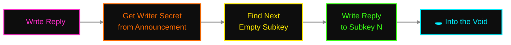
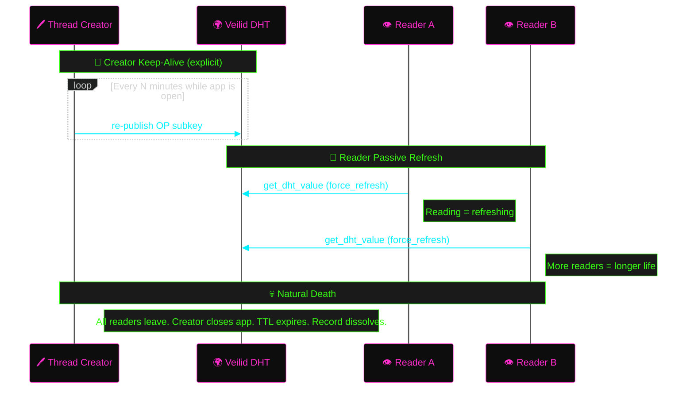
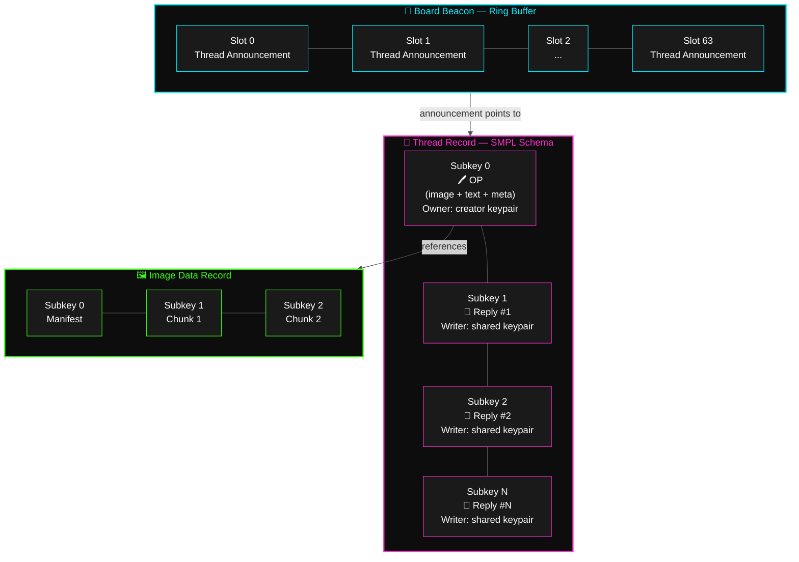
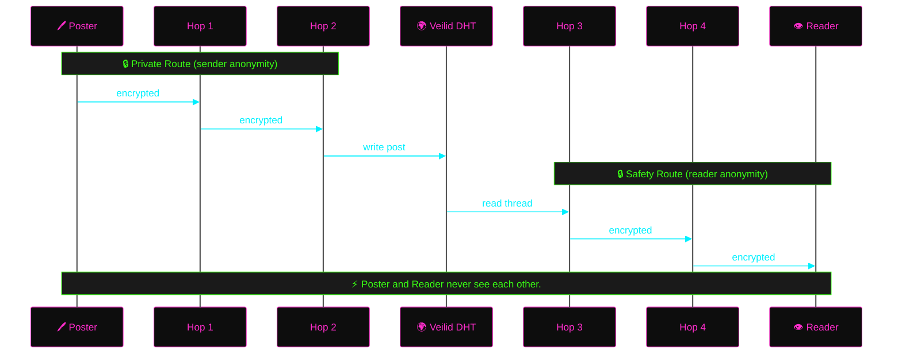
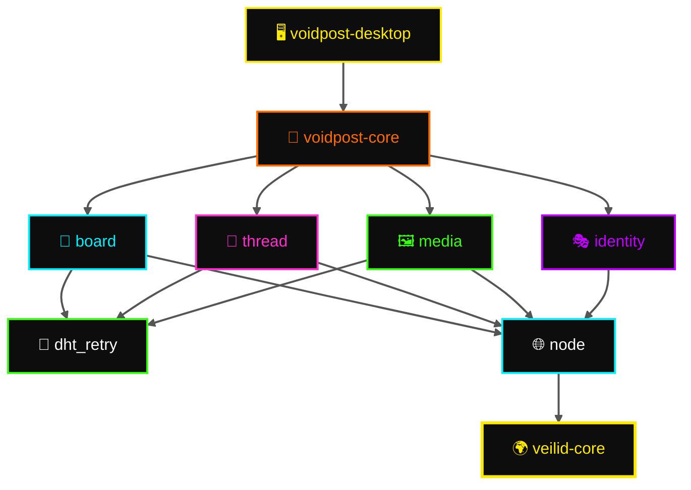

# 🕳️ Voidpost

**Anonymous imageboard on the Veilid network.**

Voidpost is a decentralized, anonymous imageboard built on
[Veilid](https://veilid.com) — the peer-to-peer framework from the
[Cult of the Dead Cow](https://cultdeadcow.com/),
the same beautiful maniacs who've been rattling the surveillance industry's
cage since 1984. No servers. No moderation hierarchy. No metadata
breadcrumbs for some three-letter agency to vacuum up. Threads
live on the Veilid DHT instead of a database. They persist as long as
people engage with them and dissolve back into nothing when they don't.
Every post is anonymous by default. Every node assembles its own view of
the board from what it hears on the network. There is no canonical state.
There is no authority. You shout into the void, and whoever's listening
hears you.

Think 4chan, but:
- 🚫 No server to seize, subpoena, or shut down
- 👻 No IP logs because there are no connections to log
- 🗝️ Anonymous by default — set a username if you want, or don't
- 💨 No permanent archive because impermanence is the point

---

## 📡 How It Works

### 🏴 Boards

A board (e.g. `/void/`) is a well-known DHT record derived deterministically
from the board name. It acts as a **beacon** — not a catalog, not a source of
truth, just a signal flare that says "something happened here recently."

The beacon address is derived via
`blake3::derive_key("voidpost.board.v1", name)`, which produces a
32-byte seed used to derive a deterministic Ed25519 keypair. The public
key becomes the DHT record address.
**Anyone who knows the board name derives the same keypair** — meaning anyone
can read *and write* to the beacon. This is the open-write model: there is no
authority controlling who can announce threads. The beacon is a public
bulletin board, not a gated community.

The beacon is a record with 64 subkeys used as a ring buffer. Each subkey
holds a thread announcement. New announcements overwrite the oldest: the
poster reads all 64 slots, finds the one with the oldest timestamp (or an
empty slot), and writes there. Concurrent posters may race for the same
slot — last write wins. The ring never blocks. Old threads are naturally
evicted by new ones, like a blackboard that only holds so many lines before
the janitor wipes the top.

The beacon is a hint. Clients that already know about threads don't need it.
Clients that just arrived use it to bootstrap. Nobody trusts it as gospel.

### 📝 Threads

Each thread is an independent DHT record using the SMPL schema:
- **Subkey 0:** OP — image + text + metadata, owned by the thread creator's
  keypair. Only the creator can modify the OP. This is the one authenticated
  post in the thread.
- **Subkeys 1..N:** Replies, writable via a shared writer keypair whose secret
  is published in the thread announcement — anyone who finds the thread can
  reply.

**Reply coordination:** repliers read the thread's current state, find the
next empty subkey, and write there. Concurrent repliers may race for the same
slot — last write wins and the displaced replier scans again. On a fast-moving
thread, some replies may need a retry. On a typical thread, contention is
rare. There is no lock server because there is no server.

Threads have a max reply count (default 300). When they're full, they're
closed. Start a new one or shut up. Natural death, same as the old boards —
except here the gravedigger is thermodynamics instead of a MySQL cronjob.

### 📋 Thread Announcements

A thread announcement is the data written to a beacon slot. It contains
everything a client needs to render a catalog entry and open the thread:

| Field | Purpose |
|-------|---------|
| `thread_key` | Veilid RecordKey for the thread record (includes built-in encryption key) |
| `writer_secret` | Secret key of the shared writer keypair — enables anyone to post replies |
| `title` | Thread subject line (plain text) |
| `timestamp` | When the thread was created |
| `op_tripcode` | Creator's tripcode, if any (for catalog display) |

The `writer_secret` being public is intentional. Anyone who can read the
beacon can reply to any thread. This means the OP is the only
cryptographically authenticated post in a thread — repliers are
indistinguishable from each other at the DHT level. For an anonymous
imageboard, this is the point: the shared keypair is an anonymity tool, not
a security flaw. Application-level identity (tripcodes) is layered on top
for users who opt in.

### 🔍 Discovery — The Gossip Model

There is no catalog server. There is no "fetch the board" API. Discovery
is gossip, and gossip is unreliable by design.

1. Board name → `blake3::derive_key("voidpost.board.v1", name)` → deterministic
   Ed25519 keypair → DHT record at a predictable address (the beacon). Anyone
   who knows the name derives the same keypair and finds the same record.
2. Clients `watch_dht_values` on the beacon. When a new thread announcement
   appears in any subkey, they fetch the thread record and add it to their
   local catalog.
3. Clients also watch threads they're reading. New reply → bump it in the
   local view.
4. Thread goes quiet → nobody refreshes it → DHT expires it → client notices
   it's gone → removes it from local catalog. Dust to dust.
5. Brand-new client joining `/void/` sees only the beacon's last 64
   announcements and builds from there. You missed it? It's gone. That's
   not a bug. That's the contract.

### ✍️ Posts

A post is the atomic unit. Every post is:
- **Text** — UTF-8, stored directly in the subkey value
- **Image** (optional) — chunked into a separate DHT data record,
  referenced by record key
- **Metadata** — timestamp, optional username + tripcode

No preview generation. No thumbnailing. No CDN. The image is ciphertext
scattered across the planet. Your client assembles and renders it. If the
image is gone, the post survives without it.

### 🔐 Encryption

Every DHT record is encrypted with a random key baked into its RecordKey at
creation time. Sharing a RecordKey shares read access. Thread RecordKeys are
published in beacon announcements. Image RecordKeys are embedded in post
metadata. This encryption is transparent — Veilid handles it, and anyone
with the key can read the record. No application-level encryption on top.

DHT node operators, relay operators, network observers — they all see
ciphertext. The only way to read a record is to have its RecordKey.
Thread RecordKeys propagate through beacon announcements. The beacon
itself is derived from the board name — knowing the name is the root
of access. Network observers who don't know which board to look for
see nothing but noise.

### 🎭 Identity

Anonymous by default. The DHT write mechanism carries no identity — thread
OPs use a keypair generated for that thread, and replies flow through a
shared writer keypair published in the thread announcement. There is nothing
in the write itself that links post A to post B. Without a username, you are
a ghost with no fingerprints.

But if you *want* to be recognizable — if you want to build a reputation in
this particular corner of the void — you can set a **username** on first
launch (or anytime later in settings). Setting a username generates a
persistent Ed25519 keypair stored locally on your machine. The public key
becomes your **tripcode** — a short hex string that proves you are who you
say you are, like 4chan's tripcode system but backed by real cryptography
instead of a hash of a password someone will crack in six minutes with
hashcat.

Your posts display as: **`username #A3F2B1C0`** — the username you chose
plus the tripcode derived from your public key. Both are stored in the post
data on the DHT. The username is cosmetic — anyone can pick any name. The
tripcode is the proof. Two people can call themselves "anon" but their
tripcodes will be different. The tripcode is what you trust, not the name.

From settings you can:
- 🔄 **Change your username** at any time — tripcode stays the same (it's
  tied to the keypair, not the name). Your old posts still show the old name
  because they're already written to the DHT. New posts show the new name.
- 📤 **Export your identity** — keypair + username as a portable JSON file.
  Move it to another machine, back it up, engrave it on a steel plate and
  bury it in the yard. Your call.
- 📥 **Import an identity** — restore from a previous export. Same keypair
  = same tripcode. Your reputation follows you.
- 🗑️ **Delete your identity** — go back to full ghost mode. The keypair is
  gone, the tripcode is dead, and nobody will ever post as you again.

Skip the username entirely and you stay fully anonymous. No identity is
attached to your posts — no username, no tripcode, no continuity. You are
noise. Beautiful, unlinkable noise.

---

## 🏗️ Architecture

The architecture is built on an insight that most decentralized projects
get catastrophically wrong: **there is no global state, and that's not a
limitation — it's the entire point.** Every client sees a different board.
Every client's reality is local. Consensus is for blockchains. We have
entropy.

If you haven't read **How It Works** above, start there — these diagrams
assume you know the vocabulary.

### 🌊 Data Flow — Posting a Thread


### 💬 Data Flow — Posting a Reply



### 📡 Data Flow — Discovering Threads


### 🔄 Record Lifecycle — Hybrid Refresh



### 🗄️ Thread Record Structure



---

## 🔄 Refresh & Persistence

Veilid DHT records are ephemeral. If nobody refreshes them, they expire and
dissolve back into nothing. For an imageboard, this is a feature — dead
threads should die. But active threads need to stay alive, and the burden
has to fall somewhere.

Voidpost uses a **hybrid refresh model**: creators keep their own threads
alive explicitly, and readers keep everything they touch alive passively
just by reading it.

### 📌 Creator Keep-Alive (Explicit)

When you create a thread, your client becomes its life support machine.
A background task periodically re-publishes the OP subkey to the DHT —
a heartbeat that says "this thread still matters to someone." This happens
automatically while the app is running. Close the app, and the heartbeat
stops. If nobody else is reading the thread, it dies. If readers are keeping
it alive through passive refresh, it survives without you.

The creator is not a server. The creator is the first interested party.
Nothing more.

### 👀 Reader Passive Refresh

Every `get_dht_value` with `force_refresh: true` causes Veilid to re-fetch
from the network and republish the value to nearby nodes. **Reading is
refreshing.** A thread with active readers stays alive automatically — the
act of lurking is the act of preservation. More readers = longer life.
Zero readers = countdown to oblivion.

This means popular threads are effectively immortal as long as people keep
browsing them. Unpopular threads die of neglect. No algorithm decides what
lives and what dies. Attention is the only currency, and you can't fake it.

### 💀 Natural Death

When the last reader leaves. When the creator closes their app. When the
TTL expires and no node on the network has reason to remember.

The record dissolves. The subkeys return to noise. The DHT nodes that
hosted it reclaim the space for something new. There is no archive. There
is no Wayback Machine. There is no "deleted but still cached somewhere."
Gone is gone.

| Record | Kept alive by | Dies when |
|--------|--------------|-----------|
| 📡 Board beacon | Any client browsing the board | Zero readers for TTL period |
| 📝 Thread (OP) | Creator's keep-alive + readers | Creator offline + no readers |
| 💬 Thread replies | Readers who fetched them | All readers leave |
| 🖼️ Image data | Readers who viewed the image | Nobody re-fetches for TTL period |

---

## 🛡️ Privacy Model

🔐 Privacy is not a feature in Voidpost. It is the architecture. Strip it
out and there is nothing left — no app, no protocol, no reason to exist.
Every design decision flows downstream from one principle: **the system
must not be capable of betraying its users, even under duress.**



- 👻 **No mandatory identity, no tokens.** Set a username if you want
  continuity, or don't. Either way there is nothing server-side to link,
  nothing to subpoena, nothing to hand over in a conference room with bad
  lighting and worse intentions.
- 🕳️ **Private Routes** — The poster's node identity is severed from DHT writes.
  Your operations bounce through multiple relay hops before they touch the
  hash table. Your IP never shares a zip code with your data.
- 🛤️ **Safety Routes** — The reader gets the same treatment in reverse.
  Browse a thread and your node ID is nowhere near the request.
- 🚫 **Zero telemetry** — No analytics. No phone-home. No clever "anonymous
  usage metrics" that always turn out to be neither anonymous nor metric.
  The only packets leaving your machine are Veilid protocol.
- 🔒 **Encrypted at rest** — Every DHT record is encrypted with a key baked
  into its RecordKey. Node operators, relay operators, network observers —
  they all see the same thing: noise. Beautiful, uninterpretable,
  plausibly-deniable noise. 📡
- 🌀 **No global state** — There is no server that knows "all threads on /void/."
  Every client's view is local and approximate. Two clients might see different
  threads in different order. That's not a bug. That's the architecture.

---

## ⚠️ Limits & Abuse

Voidpost has no server-side moderation because there is no server. This is a
deliberate trade-off: the system is censorship-resistant because it's also
moderation-resistant. Here's the honest accounting.

### 🎯 What an attacker can do

- **Flood beacon slots** — write garbage announcements to drown out real
  threads. Every slot overwritten with noise is a thread that disappears
  from new clients' view.
- **Spam replies** — the shared writer keypair means anyone can write to any
  thread. Fill 300 subkeys with garbage and the thread is bricked.
- **Impersonate repliers** — the shared keypair means replies are
  indistinguishable at the DHT level. Only tripcodes differentiate posters.

### 🛡️ What mitigates it

- **Veilid rate limiting** — the DHT network itself imposes write rate limits
  per node. Sustained flooding requires significant resources.
- **OP integrity** — only the creator's keypair can modify subkey 0. The OP
  can never be vandalized by a spammer.
- **Client-side filtering** — clients can reject malformed announcements,
  maintain local blocklists, or hide posts from untrusted tripcodes.
- **Ephemeral by nature** — spam dies when the spammer stops refreshing. The
  cost of persistent spam is persistent effort.
- **Tripcode reputation** — users with known tripcodes build client-side
  trust. Unknown or abusive posters can be locally muted.
- **Future possibilities** — proof-of-work puzzles per post, shared moderation
  lists between trusted tripcodes, client-curated board views.

The architecture trades moderation capability for censorship resistance. This
is an explicit design choice, not an oversight.

---

## 🧰 Tech Stack

Every dependency here earned its seat. No hype-driven decisions or
framework-of-the-week gambling with production stability. 🎰🚫

| Layer | Choice |
|-------|--------|
| 🌐 P2P Network | [Veilid](https://veilid.com) v0.5.2 — DHT, private routes, safety routes |
| 🦀 Language | Rust (2024 edition) |
| ⚡ Async Runtime | Tokio |
| 🔑 Key Derivation | BLAKE3 derive_key with domain separation |
| 🖥️ Desktop | [Tauri](https://v2.tauri.app) v2 — Windows, Linux, macOS (mobile later) |
| 📦 Serialization | serde + serde_json |

---

## 🗂️ Project Structure

One repo. Clean lines. Every module knows its job and stays in its lane.

```
voidpost/
├── packages/
│   ├── core/            # Rust library — the engine
│   │   ├── node.rs      # Veilid lifecycle & routing context
│   │   ├── board.rs     # Beacon records, thread discovery
│   │   ├── thread.rs    # SMPL-schema thread records, OP + replies
│   │   ├── media.rs     # Image chunking into DHT
│   │   ├── identity.rs  # Persistent tripcodes, keypair export/import
│   │   ├── dht_retry.rs # Exponential backoff for DHT operations
│   │   └── types.rs     # Post, ThreadMeta, ThreadAnnouncement
│   └── desktop/         # Tauri v2 desktop app
│       ├── src/         # Rust backend (Tauri commands)
│       └── ui/          # Web frontend
├── Cargo.toml           # Workspace root
├── LICENSE              # GPL-3.0
└── README.md
```

### 🔗 Module Dependencies



### 🧩 Veilid Primitives Used

| Feature | Veilid Primitive | Why |
|---------|-----------------|-----|
| Anonymous posting | Private routing + shared writer keypair | No per-post identity to link |
| Thread expiry | DHT record TTL | Stop refreshing, it dies |
| Image hosting | Data chunked across subkeys | DHT values cap at ~32KB |
| Board discovery | Deterministic keypair from BLAKE3 | Anyone who knows the name derives the same key |
| Thread bumping + watching | `watch_dht_values` | New reply fires `ValueChange` callback — client reorders catalog locally |
| Tripcodes | Reusable Ed25519 keypair | Real crypto, not password hashes |
| Multi-writer threads | SMPL schema | Shared keypair enables open reply participation |

---

## 🐄 Why Veilid?

Because every other option has a fatal flaw and we're tired of pretending
otherwise. 🪦

Veilid is a pure infrastructure protocol — no blockchain, no token, no
financialized incentive structure that turns every participant into a day
trader with a node. It offers encrypted P2P routing and distributed storage
as a public utility, the way the internet was supposed to work before
venture capital got its hooks into the protocol layer.

LBRY tried the token play and the SEC gutted them in open court — a $22M
fine and a full shutdown, because when you issue a token, you've handed
regulators the exact weapon they need to destroy you. Tor works, but it was
built for anonymizing streams, not distributing content. IPFS has distributed
storage but zero native anonymity — your node announces what you're hosting
to anyone who asks. GNUnet has been academically promising since 2001 and
will be academically promising when the sun burns out.

Veilid is the convergence point: anonymous routing + distributed storage +
no legal attack surface from token economics. Built by people who understand
that the most important feature of a privacy tool is not getting shut down.

---

*"🕳️ Voidpost. Shout into the void. Someone might be listening."*
